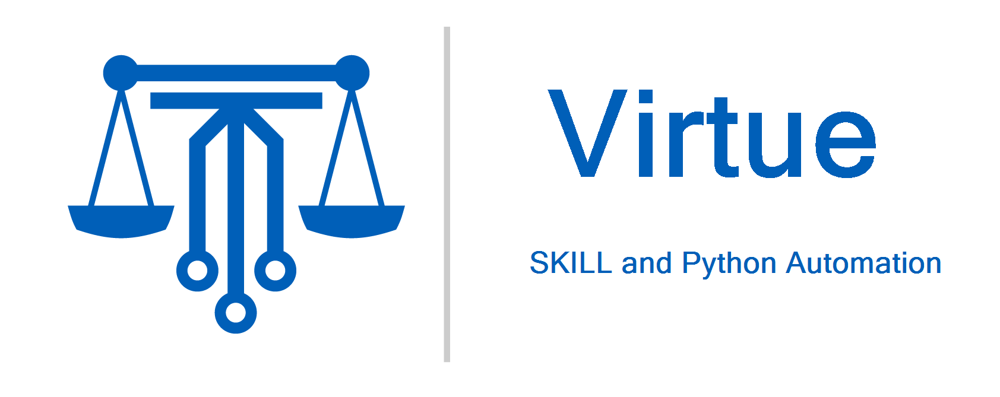

========
Overview
========

.. image:: https://img.shields.io/github/v/release/cascode-labs/virtue?include_prereleases
   :alt: GitHub release (latest by date including pre-releases)
   :target: https://github.com/cascode-labs/virtue/releases/latest
.. image:: https://img.shields.io/conda/v/conda-forge/virtue?label=conda-forge
   :alt: Conda
   :target: https://anaconda.org/conda-forge/virtue
.. image:: https://img.shields.io/pypi/v/virtue-skill
   :alt: PyPI
   :target: https://pypi.org/project/virtue-skill/
.. image:: https://img.shields.io/github/issues/cascode-labs/virtue
   :alt: GitHub issues
   :target: https://github.com/cascode-labs/virtue/issues
.. image:: https://img.shields.io/pypi/l/virtue-skill
   :alt: PyPI - License
   :target: https://choosealicense.com/licenses/mit/

| Virtue is a SKILL and Python Framework for automating IC design in `Cadence Virtuoso <https://www.cadence.com/en_US/home/tools/custom-ic-analog-rf-design/circuit-design.html>`_

Projects built with Virtue
--------------------------------

- `Softworks <https://github.com/cascode-labs/softworks>`_:
  Software and documentation view types in the Cadence Virtuoso IC design
  environment.
- `Data-panels <https://github.com/cascode-labs/data-panels>`_:
  Export rich data reports from simulation results to pptx slides and
  xlsx tables
- `Morpheus <https://github.com/cascode-labs/data-panels>`_:
  Generate Maestro test benches in a standard way compatible with an associated
  data-panels report

Features
--------

- A :ref:`SKILL standard library` of "batteries included" modules
- A :ref:`SKILL test framework` modeled after `pytest <https://docs.pytest.org/en/7.1.x/>`_
- A :ref:`SKILL TOML config file reader and writer <TOML Config Files>`
  for the `TOML standard <https://toml.io>`_
- A SKILL code packaging system

  - Simple SKILL package installation from the Python environment
  - Define :ref:`SKILL++ modules`
  - Create :ref:`SKILL++ packages`
  - Import modules into a SKILL++ environment using the top-level "Import" table

- SKILL environment manager using
  `Conda <https://docs.conda.io/en/latest/>`_ or
  `Pip <https://pip.pypa.io/en/stable/reference/build-system/pyproject-toml/>`_
- Seamless execution of SKILL from Python using
  `SkillBridge <https://unihd-cag.github.io/skillbridge/>`_

License
-------

Virtue is licensed under an MIT license.

.. dropdown:: MIT License

    .. literalinclude:: ../_static/LICENSE
       :linenos:

Other Open Source SKILL Projects
--------------------------------

- `skillbridge Python-SKILL interface <https://unihd-cag.github.io/skillbridge/>`_
- `SKILL_Tools Utilities for working with Cadence's SKILL/SKILL++ <https://github.com/MatthewLoveQUB/SKILL_Tools>`_
- `cdsgit Git design manager <http://cdsgit.github.io/cdsgit/>`_
- `cdsdm Git design manager <https://github.com/cdsdm/cdsdm>`_

.. toctree::
   :maxdepth: 2
   :caption: Contents:
   :hidden:

   install
   standard_library
   testing_framework
   cli
   packaging/index
   conda
   toml
   release_notes
