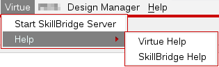

*****************
SKILL++  Packages
*****************

A SKILL++ package is a set of related SKILL++ modules defined as part of a
project.  Normally each project contains a single SKILL++ package.

A Virtue SKILL++ conda package can :
* Automatically initialize it's SKILL Code
* Customize the library manager
* Register custom view types with the data registry
* Add OA libraries to the library manager

Initialize SKILL
----------------

Each SKILL++ package should have a "<project-name>.init.ils" (SKILL++) or
a "<project-name>.init.il" (SKILL) initialization file.  It should be located
in the top-level source code directory.  This init file should load all the
rest of the package's files and initialize all of its modules.

The virtue-environment.ils script initializes each package in the Virtue
SKILL environment containing it.
The Virtue package is initialized first, followed by all
the initialization scripts of all the other packages.  The
initialization scripts should be contained in $CONDA_PREFIX/lib/skill
or, preferrably, a direct  subfolder. The
initialization scripts are any SKILL files with
".init.ils" (SKILL++) or ".init.il" (SKILL) suffixes

The virtue initialization script is ran in virtuoso when Virtuoso is started with
the sp command.

Customize the Library Manager
-----------------------------

A Virtue SKILL++ package can customize the Virtuoso library manager to
customize its menus and settings. See the installation instructions for how
the library customization environment initialization script can be called.

A library manager initialization script can be included in the source code
directory.  This file needs to end in "cdsLibMgr.il". This file can contain
calls to any of the
`library manager SKILL functions <https://support.cadence.com/apex/techpubDocViewerPage?path=caiskill/caiskillICADVM20.1/Imgr.html#pgfId-962695>`_.
These functions **cannot** be called from the main SKILL initialization script
which is loaded in the top-level SKILL environment.

A project can add additional entries in the Virtue library manager menu
which cab be referenced by name, "**VirtueMenu**".
If more than one item is needed for a project, it should be added as a
sub-menu.  Links to documentation for other projects can also be added to the
"**VirtueHelpMenu**".

see :ref:`Install the Library Manager Customizations` for installation information.

Examples:

See `Library Manager customization example file <https://support.cadence.com/apex/ArticleAttachmentPortal?id=a1Od0000000nYpvEAE&pageName=ArticleContent>`_
from Cadence online support for examples.

.. dropdown:: Virtue's virtue.cdsLibMgr.il script

    .. literalinclude:: ../../_static/src/virtue.cdsLibMgr.il
       :language: lisp
       :linenos:

Data Registry Customization
---------------------------

A virtue conda package can customize the Virtuoso data registry to include
custom view types in the library manager.  The package should include a
data.reg file in its SKILL lib folder and then add this as a SOFTINCLUDE in
the virtue.data.reg file in the root SKILL library.  Here's an example line
to install the data.reg in the build.sh script of the Softworks conda recipe.

.. code-block:: bash
   :linenos:
   :caption: conda build.sh code to install a package's data.reg

   # Install data.reg
   echo "SOFTINCLUDE ${PREFIX}/lib/skill/Softworks/data.reg;" >> \
   "${PREFIX}/lib/skill/virtue.data.reg"

See the :ref:`Install View Types <install_view_types>` section for
environment setup instructions.

Cadence Libraries
-----------------
A Conda SKILL package can add libraries to Virtuoso by adding its own cds.lib entry to the
environment's common cds.lib file.  This entry should be created as part of
the package's Conda recipe in the build.sh script. Here's an example of the
build commands:

.. code-block:: bash
   :linenos:
   :caption: conda build.sh code to install a package's cds.lib

   # Install Cadence Virtuoso libraries
   echo "SOFTINCLUDE ${PREFIX}/lib/skill/Softworks/cds.lib" >> \
   "${PREFIX}/lib/skill/cds.lib"

An entry is then added to each project's cds.lib file to
SOFTINCLUDE the environment's common cds.lib file.
